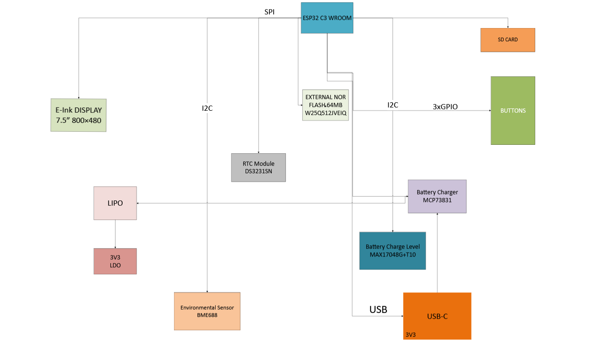

## PCB Description

#### ESP 
ESP32-C6-WROOM-1 is a general-purpose Wi-Fi, IEEE 802.15.4, and Bluetooth LE 
module. The rich set of peripherals and high performance make the module an 
ideal choice for smart homes, industrial automation, health care, consumer electronics, etc.

#### Absolute Maximum Ratings

| Symbol  | Parameter            | Min  | Max | Unit |
| ------- | -------------------- | ---- | --- | ---- |
| VDD33   | Power supply voltage | –0.3 | 3.6 | V    |
| T STORE | Storage temperature  | –40  | 105 | °C   |

##### CPU and On-Chip Memory
    • ESP32-C6 embedded, 32-bit RISC-V single-core microprocessor, up to 160 MHz
    • 320 KB ROM
    • 512 KB SRAM
    • 16 KB Low-power (LP) SRAM

#### W25Q512JVEIQ

External NOR flash memory offering high-density storage.

Specifications:

• Capacity: 512 Mbit (64 MB)
• Interface: SPI (Serial Peripheral Interface)
• Operating Voltage: 3.3 V
• Usage: Firmware, configuration data, graphical assets storage

#### MCP73831

Li-Po battery charger controller for efficient battery management.

Specifications:

• Charge Current: Programmable up to ~500 mA
• Charge Voltage: Fixed 4.2 V
• Input Voltage: 5 V (typically USB)
• Features: Thermal protection, automatic charge termination, LED charge status

#### XC6220A331MR-G

Low Dropout Voltage Regulator ensuring stable power.

Specifications:

• Output Voltage: 3.3 V
• Input Voltage Range: up to 6.0 V
• Current Rating: up to 700 mA

#### MAX17048G+T10

Battery Fuel Gauge IC for precise battery monitoring.

Specifications:

• Communication Interface: I²C
• Voltage Measurement Accuracy: ±7.5 mV
• Typical Current Consumption: 23 µA
• Usage: State-of-charge monitoring, battery life estimation

#### BME688

Advanced environmental sensor providing multiple parameters.

Specifications:

• Measurements: Temperature, Humidity, Pressure, VOC gas sensing
• Communication Interface: I²C
• Operating Voltage: 1.7 V – 3.6 V

#### DS3231SN

Highly accurate Real-Time Clock (RTC) module.

Specifications:

• Accuracy: ±2 ppm (~1 min/year)
• Communication Interface: I²C
• Operating Voltage: 2.3 V – 5.5 V
• Features: Integrated battery backup for uninterrupted timekeeping

#### FH34SRJ-24S-0.5SH(99)

FFC connector for reliable display connection.

Specifications:

• Pins: 24
• Pitch: 0.5 mm
• Mount Type: Surface Mount (SMD)
• Usage: Connecting E-paper displays

#### MBR0530

Schottky diode with low forward voltage.

Specifications:

• Maximum Current: 0.5 A
• Forward Voltage Drop: ~0.3-0.4 V
• Application: Reverse voltage protection, efficient switching

#### SI1308EDL-T1-GE3

Compact N-channel MOSFET for switching applications.

Specifications:

• Voltage Rating: 20 V
• Current Rating: ~2 A
• Usage: Switching operations in display driver circuits

#### CPH3225A

Supercapacitor designed for temporary backup power.

## Pins

#### SD Card (SPI)
    * pin 7 -> pin 27 (MISO)
    * pin 3 -> pin 7 (MOSI)
    * pin 2 -> pin 4 (SS_SD)
    * pin 5 -> pin 6 (SCK)

#### 3 Buttons
    • IO/BOOT on pin 15 
    • IO/CHANGE on pin 23
    • RESET on pin 3

#### Battery Charge Level
    • pin 7 -> pin 20 (SCL)
    • pin 8 -> pin 19 (SDA)

#### BME688
    • pin 6, 8, 2 -> pin 17 (I2C_PW)
    • pin 4 -> pin 20 (SCL)
    • pin 3 -> pin 19 (SDA)

##### RTC Module DS3231SN
    • pin 4 -> pin 16 (RTC_RST)
    • pin 16 -> pin 20 (SCL)
    • pin 15 -> pin 19 (SDA)
    • pin 3 -> pin 8 (INT_RTC)
    • pin 1 -> pin 9 (32KHz)

#### USB C connector & ESD protection
    • pin 1 -> pin 14 (USB_D+)
    • pin 3 -> pin 13 (USB_D-)
    

## Bill Of Materials (BOM):

| Component                   | Quantity | Price (€) | Link                                                                                                                            | Datasheet                                                                                                                             |
| :-------------------------- | -------- | --------- | ------------------------------------------------------------------------------------------------------------------------------- | ------------------------------------------------------------------------------------------------------------------------------------- |
| W25Q512JVEIQ                | 1        | 5.84      | https://eu.mouser.com/ProductDetail/Winbond/W25Q512JVEIQ?qs=l7cgNqFNU1jw6svr3at6tA%3D%3D                                        | https://eu.mouser.com/datasheet/2/949/Winbond_W25Q512JV_Datasheet-3240039.pdf                                                         |
| MAX17048G+T10               | 1        | 4.28      | https://eu.mouser.com/ProductDetail/Analog-Devices-Maxim-Integrated/MAX17048G%2bT10?qs=D7PJwyCwLAoGnnn8jEPRBQ%3D%3D             | https://eu.mouser.com/datasheet/2/609/MAX17048_MAX17049-3469099.pdf                                                                   |
| ESP32-C6-WROOM-1-N8         | 1        | 2.97      | https://eu.mouser.com/ProductDetail/Espressif-Systems/ESP32-C6-WROOM-1-N8?qs=8Wlm6%252BaMh8ST02Gmwp74cw%3D%3D                   | https://eu.mouser.com/datasheet/2/891/Espressif_ESP32_C6_WROOM_1__Datasheet_V0_1_PRELIMI-3239987.pdf                                  |
| 112A-TAAR-R03_ATTEND        | 1        | 1.05      | https://store.comet.srl.ro/Catalogue/Product/43497/                                                                             | https://store.comet.bg/download-file.php?id=27596                                                                                     |
| QWIIC_RIGHT_ANGLE           | 1        | 3.75      | https://eu.mouser.com/ProductDetail/Adafruit/4208?qs=PzGy0jfpSMtbScLbr0L5dw%3D%3D                                               | https://cdn-shop.adafruit.com/datasheets/HX8340-B_N__DS_preliminary_v01_071203.pdf                                                    |
| BD5229G-TR                  | 1        | 0.75      | https://eu.mouser.com/ProductDetail/ROHM-Semiconductor/BD5229G-TR?qs=4kLU8WoGk0vvnhrrYwdszw%3D%3D                               | https://fscdn.rohm.com/en/products/databook/datasheet/ic/power/voltage_detector/bd52xxg-e.pdf                                         |
| 1uF capacitor               | 1        | 0.13      | https://eu.mouser.com/ProductDetail/TAIYO-YUDEN/MAASL105CC7105MFCA01?qs=HFfMDpzxxd1Fn%2FInbJA7vw%3D%3D                          | https://eu.mouser.com/datasheet/2/396/TAIYO_YUDEN_04_27_2024_c_mlcc_A_e1-3451516.pdf                                                  |
| PGB1010603MR                | 6        | 0.40      | https://eu.mouser.com/ProductDetail/Littelfuse/PGB1010603MR?qs=gu7KAQ731URLg4GSnNNN7Q%3D%3D                                     | https://www.littelfuse.com/assetdocs/pulseguard-esd-suppressors-pgb1-datasheet?assetguid=8a337998-d54d-466b-be4e-dc5bcd1f9321         |
| MCP73831                    | 1        | 0.16      | https://eu.mouser.com/ProductDetail/Microchip-Technology/MCP73831T-5ACI-OT?qs=hH%252BOa0VZEiAcgAcEkuamXg%3D%3D                  | https://eu.mouser.com/datasheet/2/268/MCP73831_Family_Data_Sheet_DS20001984H-3441711.pdf                                              |
| 200 ohm resistor            | 1        | 0.10      | https://eu.mouser.com/ProductDetail/Wurth-Elektronik/560112110211?qs=sGAEpiMZZMtlubZbdhIBIIgWRUA0vTGpVUEy0IEGMjk%3D             | https://www.we-online.com/components/products/datasheet/560112110211.pdf                                                              |
| 2k ohm resistor             | 1        | 0.57      | https://eu.mouser.com/ProductDetail/Vishay-Beyschlag/MCS04020D2321BE100?qs=sGAEpiMZZMtlubZbdhIBINHXX5XJLWKoe%2FyX%252BeuBVuo%3D | https://www.vishay.com/docs/28700/mcx0x0xpre.pdf                                                                                      |
| XC6220A331MR-G              | 1        | 1.46      | https://eu.mouser.com/ProductDetail/Torex-Semiconductor/XC6220A331MR-G?qs=AsjdqWjXhJ8ZSWznL1J0gg%3D%3D                          | https://eu.mouser.com/datasheet/2/760/xc6220-3371556.pdf                                                                              |
| 100uF tant capacitor        | 1        | 25.19     | https://eu.mouser.com/ProductDetail/Vishay-Sprague/T97F107M035HAA?qs=kE1vTINknaW2TSWjulhndg%3D%3D                               | https://www.vishay.com/docs/40092/t97.pdf                                                                                             |
| 100k resistor               | 1        | 0.30      | https://eu.mouser.com/ProductDetail/Vishay-BC-Components/NTCS0402E3104JHT?qs=8wHch9UpSvY0bmpK2FbGWQ%3D%3D                       | https://www.vishay.com/docs/29003/ntcs0402e3t.pdf                                                                                     |
| CPH3225A                    | 1        | 2.33      | https://eu.mouser.com/ProductDetail/Seiko-Semiconductors/CPH3225A?qs=3etwrb1wR%252BhUOph6lAO7eg%3D%3D                           | https://eu.mouser.com/datasheet/2/360/Seiko_Instruments_MicroBattery_E_20230330_2024Jan_-3561061.pdf                                  |
| R_CAPACITOR                 | 1        | 0.12      | https://eu.mouser.com/ProductDetail/Panasonic/ERJ-2RKD15R0X?qs=8CJXEYeWfIrWZI67d3moiA%3D%3D                                     | https://industrial.panasonic.com/cdbs/www-data/pdf/RDA0000/AOA0000C304.pdf                                                            |
| FH34SRJ-24S-0.5SH_99_       | 1        | 2.60      | https://eu.mouser.com/ProductDetail/Hirose-Connector/FH34SRJ-24S-0.5SH99?qs=vcbW%252B4%252BSTIpKBl5ap9J8Fw%3D%3D                | https://eu.mouser.com/datasheet/2/185/FH34SRJ_24S_0_5SH_99__CL0580_1255_6_99_2DDrawing_0-1615044.pdf                                  |
| 0.1uF/50V capacitor         | 1        | 0.45      | https://eu.mouser.com/ProductDetail/KYOCERA-AVX/04025C104MAT2A?qs=sGAEpiMZZMukHu%252BjC5l7YbsWA2wxb4GLrh7pRRirNkk%3D            | https://eu.mouser.com/datasheet/2/40/KGM_X7R-3223212.pdf                                                                              |
| 1uF/50V capacitor           | 10       | 0.56      | https://eu.mouser.com/ProductDetail/TAIYO-YUDEN/MAASU32NSB7105KTCA01?qs=HFfMDpzxxd06eur8w0VYhA%3D%3D                            | https://eu.mouser.com/datasheet/2/396/TDK_4_24_2024_MAASU32NSB7105KTCA01_SS-3440852.pdf                                               |
| 2k ohm resistor             | 1        | 0.57      | https://eu.mouser.com/ProductDetail/Vishay-Beyschlag/MCS04020D2321BE100?qs=sGAEpiMZZMtlubZbdhIBINHXX5XJLWKoe%2FyX%252BeuBVuo%3D | https://www.vishay.com/docs/28700/mcx0x0xpre.pdf                                                                                      |
| BME688                      | 1        | 14.82     | https://eu.mouser.com/ProductDetail/Bosch-Sensortec/BME680-Shuttle-Board-3.0?qs=Wj%2FVkw3K%252BMABg5lm5143Ww%3D%3D              | https://eu.mouser.com/datasheet/2/783/bst_bme680_sf000-2486508.pdf                                                                    |
| 2.2 ohm resistor            | 1        | 0.15      | https://eu.mouser.com/ProductDetail/Panasonic/ERJ-PA2J2R2X?qs=sGAEpiMZZMtlubZbdhIBIKn8wLs5z3UnO%252BN6Zqj8Y2A%3D                | https://industrial.panasonic.com/cdbs/www-data/pdf/RDO0000/AOA0000C331.pdf                                                            |
| MBR0530                     | 3        | 0.18      | https://eu.mouser.com/ProductDetail/onsemi/MBR0530T3G?qs=3JMERSakebpEmdUS6GetdQ%3D%3D                                           | https://www.onsemi.com/download/data-sheet/pdf/mbr0530t1-d.pdf                                                                        |
| SI1308EDL-T1-GE3            | 1        | 0.42      | https://eu.mouser.com/ProductDetail/Vishay-Semiconductors/SI1308EDL-T1-GE3?qs=bX1%252BNvsK%2FBramh9tgpOaEw%3D%3D                | https://www.vishay.com/docs/63399/si1308edl.pdf                                                                                       |
| 0.47 ohm resistor           | 1        | 0.61      | https://eu.mouser.com/ProductDetail/ROHM-Semiconductor/UCR01MVPFLR470?qs=493kPxzlxfJor42A3tTE6g%3D%3D                           | https://fscdn.rohm.com/en/products/databook/datasheet/passive/resistor/chip_resistor/ucr-e.pdf                                        |
| 4.7uF/25V capacitor         | 1        | 0.27      | https://eu.mouser.com/ProductDetail/KYOCERA-AVX/04023D475MAT2A?qs=sGAEpiMZZMsh%252B1woXyUXj%252BCoURFk43JpehNp%2F1Fl9pk%3D      | https://eu.mouser.com/datasheet/2/40/cx5r-2835979.pdf                                                                                 |
| 68uH ind                    | 1        | 1.37      | https://store.comet.srl.ro/CatalogueFarnell/Product/1302649/                                                                    | https://www.we-online.com/components/products/datasheet/744043680.pdf                                                                 |
| 10uF capacitor              | 1        | 0.28      | https://eu.mouser.com/ProductDetail/KYOCERA-AVX/KGM05CS60J106MH?qs=9vOqFld9vZXSfhl2b2Q2gQ%3D%3D                                 | https://eu.mouser.com/datasheet/2/40/KGM_X6S-3223173.pdf                                                                              |
| SAMACSYS_PARTS_USB4110-GF-A | 1        | 1.18      | https://eu.mouser.com/ProductDetail/GCT/USB4110-GF-A?qs=KUoIvG%2F9IlYiZvIXQjyJeA%3D%3D                                          | https://eu.mouser.com/datasheet/2/837/GCT_USB4110_Product_Drawing___20k_cycles-3455479.pdf                                            |
| PFMF.050.1                  | 1        | 0.28      | https://eu.mouser.com/ProductDetail/Schurter/PFMF.050.2?qs=1auRipcfynCums5v1iucSA%3D%3D                                         | https://eu.mouser.com/datasheet/2/358/typ_PFMF-1275918.pdf                                                                            |
| 5k1 resistor                | 2        | 0.15      | https://eu.mouser.com/ProductDetail/Vishay-Beyschlag/MCS04020C5101FE000?qs=sGAEpiMZZMtlubZbdhIBIMAhWB6%252BRofmP3o4x7R7qwI%3D   | https://www.vishay.com/docs/28705/mcx0x0xpro.pdf                                                                                      |
| Battery                     | 1        | 10.45     | https://www.emag.ro/acumulator-li-polymer-2500mah-3-7v-104050-243/pd/D6VB6SMBM/                                                 | https://www.ufinebattery.com/images/upload/ufx0165-11-3-7v-2500mah-lithium-ion-battery-product-datasheet.pdf                          |
| Display                     | 1        | 44.12     | https://www.waveshare.com/7.5inch-e-paper.htm                                                                                   | https://files.waveshare.com/upload/6/60/7.5inch_e-Paper_V2_Specification.pdf                                                          |
| 100nF capacitor             | 8        | 0.013     | https://store.comet.srl.ro/Catalogue/Product/48939/                                                                             | https://store.comet.bg/download-file.php?id=11                                                                                        |
| 10k resistor                | 16       | 0.19      | https://eu.mouser.com/ProductDetail/Vishay/MCS04020D1022BE000?qs=pUKx8fyJudATYWOpd0Fc%2FA%3D%3D                                 | https://www.vishay.com/docs/28700/mcx0x0xpre.pdf                                                                                      |
| 4.7uF capacitor             | 5        | 0.82      | https://eu.mouser.com/ProductDetail/KEMET/C0402C475K8PACTU?qs=sGAEpiMZZMsh%252B1woXyUXj%252BeMYF%2FJh1ZHWLnD7xub%252BoY%3D      | https://eu.mouser.com/datasheet/2/447/KEM_C1006_X5R_SMD-3316465.pdf                                                                   |
| SD0805S020S1R0              | 2        | 0.30      | https://eu.mouser.com/ProductDetail/KYOCERA-AVX/SD0805S020S1R0?qs=jCA%252BPfw4LHbpkAoSnwrdjw%3D%3D                              | https://eu.mouser.com/ProductDetail/KYOCERA-AVX/SD0805S020S1R0?qs=jCA%252BPfw4LHbpkAoSnwrdjw%3D%3D                                    |
| DMG2305UX-7                 | 2        | 0.2       | https://store.comet.srl.ro/CatalogueFarnell/Product/1773598/                                                                    | https://4donline.ihs.com/images/VipMasterIC/IC/DIOD/DIOD-S-A0013043571/DIOD-S-A0013120650-1.pdf?hkey=6D3A4C79FDBF58556ACFDE234799DDF0 |

#### TOTAL: 145.79 euro

## Diagram

##### Design log:
Pentru PCB am acceptat 2 erori de Board Outline Clearence deoarece asa se spune
in OCW si 4 erori de Silkscreen Clearance deoarece nu puteam face nimic sa indepartez acele erori...asta e